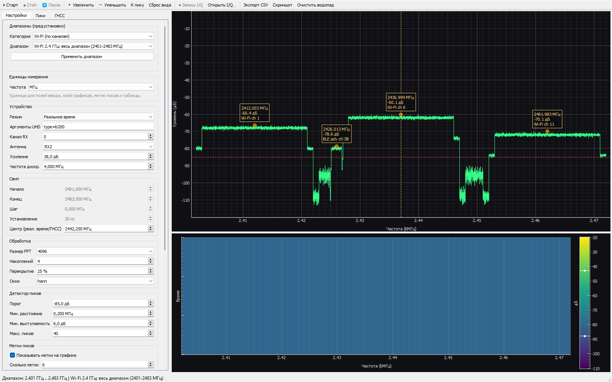
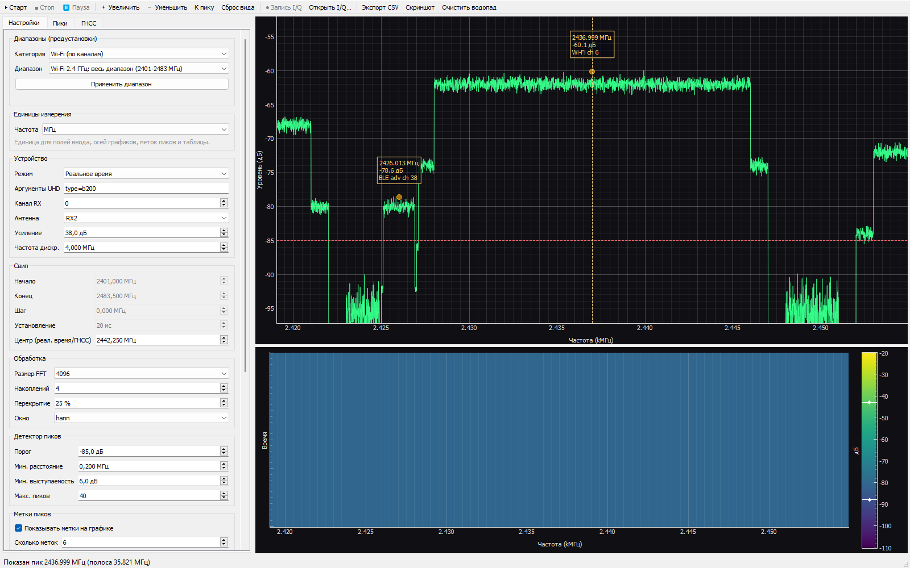
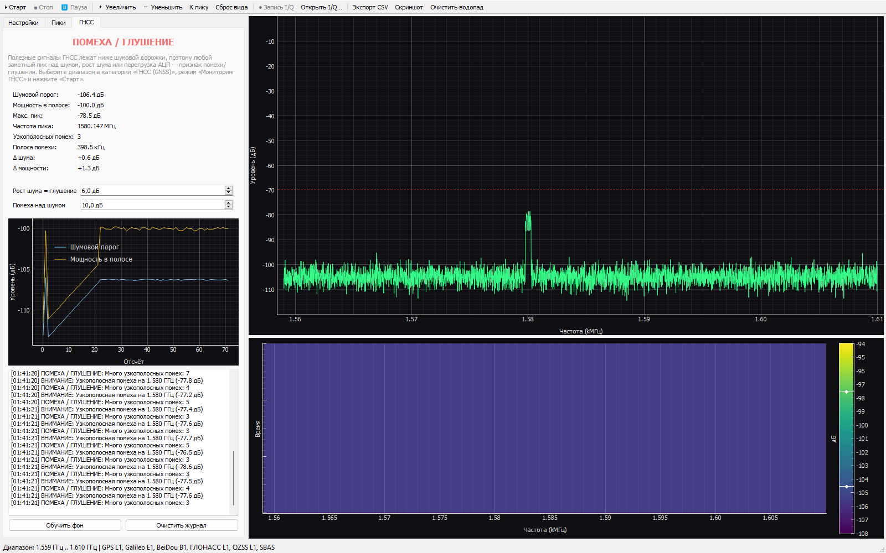

# SDR Scan — анализатор спектра для USRP B210

Приложение на Python + UHD + PyQt5: свип по частотам, режим реального
времени, мониторинг ГНСС, водопад, автоматический детектор пиков с
распознаванием каналов, запись и офлайн-анализ I/Q, экспорт в CSV и PNG.
Есть масштабирование графика (рамка, кнопки, «К пику»), пауза без
прерывания приёма и запуск на Windows и Linux.



*Режим реального времени: три канала Wi-Fi 2.4 ГГц и рекламный канал BLE
38 с автоматическими подписями; справа — водопад. Выбранный пик отмечен
вертикальной линией.*



*Кнопка «К пику» сужает спектр и водопад к выбранному каналу (Wi-Fi ch 6):
видно форму сигнала и уровень шума в паузах.*



*Мониторинг ГНСС: рост шумовой дорожки и узкополосная помеха распознаны
как «ПОМЕХА / ГЛУШЕНИЕ».*

---

## Возможности

- **Три режима**
  - *Свип по частотам* — сканирует произвольный диапазон (например,
    88–108 МГц), перестраивая центр приёма с перекрытием и сшивая
    участки в сплошной спектр без разрывов.
  - *Реальное время* — непрерывный поток на фиксированном центре,
    быстрый обзор полосы приёма (до ~56 МГц у B210).
  - *Мониторинг ГНСС* — наблюдение полосы навигационных сигналов и
    детекция помех/глушения (без декодирования навигации).
- **Водопад** (spectrogram) с настраиваемым числом строк и цветовой
  шкалой, колорбар.
- **Детектор пиков**: порог, минимальное расстояние, минимальная
  «выступаемость»; устойчив к плоским вершинам цифровых сигналов —
  максимумы на одном «горбе» (канал Wi-Fi, полоса LTE) считаются **одним**
  сигналом, а частота берётся как центроид горба (совпадает с центром
  канала).
- **Единый выбор единиц** (ГГц / МГц / кГц / Гц) для полей ввода, осей
  графиков, подписей пиков и таблицы.
- **Масштаб графика**: кнопки **「＋ Увеличить」/「－ Уменьшить」**, выделение
  области **рамкой** левой кнопкой мыши и **«К пику»** — одним нажатием
  показать выбранный пик (спектр сужается по частоте и уровню, водопад —
  по частоте). Зум ограничен полосой B210 (70 МГц … 6 ГГц), «Сброс вида»
  возвращает обзор.
- **Пауза (Ctrl+P)**: замораживает картинку, **не прерывая приём и запись
  I/Q** — удобно рассмотреть спектр или водопад, ничего не потеряв.
- **Выбор пика**: клик по пику на спектре или строке таблицы — пик
  подсвечивается, для него доступны «К пику» и «водопад на пик».
- **Метки пиков**: показываются только «устоявшиеся» пики (без дёрганья),
  состав строки настраивается (частота, уровень, выступаемость, полоса,
  канал), при тесноте подписи разводятся по высоте.
- **Распознавание каналов** по частоте и измеренной полосе: Wi-Fi, BLE,
  LTE, ГНСС, FM, DAB, DVB-T, GSM, TETRA, ISM, ADS-B, AIS и др.
- **Ограничение масштаба** графиков полосой B210 (70 МГц … 6 ГГц) и кнопка
  **«Сброс вида»** — «уехать» в пустоту при зуме нельзя.
- **Запись I/Q** в `complex64` или `int16` с файлом метаданных `.json`
  (частота, полоса, усиление, время) и **офлайн-анализ** записанного файла.
- **Мониторинг ГНСС**: контроль шумовой дорожки и полосы L1/E1/B1 и др.,
  детекция узкополосных помех, роста шума и перегрузки приёмника.
- **Экспорт**: спектр и список пиков в CSV, скриншот области графиков в PNG.
- **Предустановленные диапазоны**: BLE, Wi-Fi по каналам (2.4/5/6 ГГц),
  LTE по бэндам (DL/UL/TDD), ГНСС по системам и сигналам, а также FM, GSM,
  ISM, ADS-B, AIS и другие — в один клик.
- **Диагностика**: кнопка «Найти», `scripts/check_device.py`.

---

## Требования

| Компонент | Версия |
|---|---|
| ОС | Windows 10 22H2 / 11, либо Linux (Ubuntu 20.04+ / Debian 11+) |
| Python | **3.10–3.13** (рекомендуется 3.13) |
| UHD | 4.10.0.0 (Windows: инсталлятор + wheel; Linux: пакеты apt или сборка из исходников) |
| Оборудование | USRP B210, USB 3.0 |

> **Почему не Python 3.14?** Пакет `uhd` на PyPI публикуется только под
> конкретные версии Python (`cp310`, `cp312`, `cp313`). Под 3.14 wheel'ов
> нет, поэтому нужен Python 3.13 или ниже.

---

## Установка

### Windows

#### 1. Python и зависимости приложения

```powershell
cd E:\MySoftware\SDR_Scan
py -3.13 -m venv .venv
.\.venv\Scripts\Activate.ps1
pip install -r requirements.txt
```

#### 2. UHD (нужен только для работы с реальным устройством)

Wheel `uhd` содержит только Python-привязки и **не содержит `uhd.dll`**.
Поэтому сначала ставится UHD-инсталлятор, затем wheel той же версии.

**a. Инсталлятор.** Скачать из каталога релиза
<https://files.ettus.com/binaries/uhd/uhd_004.010.000.000-release/>
файл вида `uhd_4.10.0.0-release_Win64_VS2022.exe` и установить
(по умолчанию в `C:\Program Files\UHD`).

Инсталлятор:
- создаёт переменную окружения `UHD_PKG_PATH` (её ищет модуль `uhd`);
- ставит USB-драйвер для B210 (Windows-пакеты ставятся автоматически).

**b. Python-привязки** (версия должна совпадать с инсталлятором):

```powershell
pip install uhd==4.10.0.0
```

**c. Проверка:**

```powershell
python -c "import uhd; print(uhd.__version__)"
python scripts\check_device.py
```

> Если `import uhd` печатает предупреждение о конфликте версий — выровняйте
> версии инсталлятора и wheel (например, оба 4.10.0.0). Если UHD установлен
> не в `C:\Program Files\UHD`, задайте путь вручную:
> `set UHD_PKG_PATH=D:\UHD` (или добавьте `bin` в `PATH`).

Альтернатива: `conda install -c conda-forge uhd` — тогда UHD-библиотека и
привязки приходят одним пакетом, а инсталлятор не нужен.

### Linux (Ubuntu / Debian)

Всё то же приложение работает на Linux без изменений в коде. Проще всего —
готовый скрипт:

```bash
cd /opt/SDR_Scan          # каталог с проектом
./scripts/setup_linux.sh  # поставит apt-пакеты UHD, udev-правила и venv
```

Скрипт по шагам делает то же, что и вручную:

```bash
sudo apt update
sudo apt install -y libuhd-dev uhd-host python3-uhd python3-venv python3-pip
sudo uhd_images_downloader                      # образы FPGA/прошивки B210

# доступ к USRP по USB без root
sudo cp /lib/uhd/utils/uhd-usrp.rules /etc/udev/rules.d/
sudo udevadm control --reload-rules && sudo udevadm trigger

# ВАЖНО: --system-site-packages, чтобы в venv был виден системный python3-uhd
python3 -m venv --system-site-packages .venv
.venv/bin/python -m pip install --upgrade pip
.venv/bin/python -m pip install -r requirements.txt
```

Проверка и запуск:

```bash
.venv/bin/python scripts/check_device.py
./run.sh                       # или: .venv/bin/python run.py
```

Нюансы Linux:

- **Порядок загрузки UHD/Qt** (проблема `0xC0000005` на Windows) здесь не
  актуален — на Linux `import uhd` в `sdrscan/__init__.py` просто безвреден.
- **`python3-uhd` ставится через apt**, а не через pip (pip-wheel'ы UHD есть
  только под Windows). Поэтому venv создаётся с `--system-site-packages`.
  Если так не хочется, соберите UHD из исходников
  (<https://github.com/EttusResearch/uhd>) с `-DENABLE_PYTHON_API=ON`.
- **Wayland**: если окно не появляется, запустите `QT_QPA_PLATFORM=xcb ./run.sh`.
- **USB 3.0**: подключайте B210 к порту USB 3 (синий); при ошибках питания —
  отдельный USB-хаб с внешним питанием.
- **Дистрибутивы без apt** (Fedora, Arch): те же шаги, пакеты называются
  `uhd`, `uhd-devel`, `python3-uhd`.

---

## Запуск

Windows:

```powershell
.\.venv\Scripts\python run.py
```

Linux:

```bash
./run.sh                  # использует .venv/bin/python, если он есть
```

Полезные опции:

```powershell
python run.py --list-devices                 # показать подключённые USRP
python run.py --start 88 --stop 108          # свип FM-диапазона, МГц
python run.py --mode realtime --center 100   # реальное время, центр 100 МГц
python run.py --mode gnss --center 1584.5    # мониторинг ГНСС (L1/E1/B1)
python run.py --rate 8 --gain 40 --fft 8192  # полоса 8 МГц, усиление 40 дБ
```

Полный список — `python run.py --help`.

---

## Как пользоваться

1. Быстрый старт: в группе **«Диапазоны (предустановки)»** выберите
   **Категорию** и **Диапазон**, нажмите **«Применить диапазон»** — границы
   свипа, центр и частота дискретизации подставятся автоматически.
   Либо задайте всё вручную, как ниже.
2. При необходимости выберите **«Единицы измерения»** (ГГц / МГц / кГц / Гц) —
   переключатель действует на поля ввода, оси графиков, подписи и таблицу.
3. Выберите **Режим**: `Свип`, `Реальное время` или
   `Мониторинг ГНСС (помехи)`.
4. Для свипа задайте **Начало**, **Конец** и (опционально) **Шаг** —
   `0` означает авто: `шаг = полоса_приёма × (1 − перекрытие)`.
   Для реального времени и ГНСС задайте **Центр**.
5. Настройте **Усиление**, **Антенну** (`RX2` — основной вход B210),
   **Частоту дискретизации**, **Размер FFT**, **Накоплений**.
6. Нажмите **▶ Старт**. Спектр и водопад начнут обновляться.
7. Настройте **Детектор пиков** и группу **«Метки пиков»** — список пиков
   появится на вкладке «Пики», подписи — на графике.
8. В режимах «Реальное время» и «ГНСС» доступна кнопка **● Запись I/Q**:
   файл `.iq` и рядом `.json` с метаданными. Открыть ранее записанный файл —
   кнопка **«Открыть I/Q…»** (работает и без устройства).
9. **Экспорт CSV** / **Скриншот** / **Сброс вида** — сохранить результат
   или вернуть графики в исходный масштаб.
10. Рассмотреть детали помогают **「＋ Увеличить」/「－ Уменьшить」**, рамка
    мышью, **«К пику»** (выбранный пик — кликом по спектру или строке
    таблицы) и **пауза Ctrl+P** — она замораживает картинку, но приём и
    запись продолжаются.

### Параметры

| Параметр | Смысл |
|---|---|
| Начало / Конец | Границы свипа, в выбранных единицах |
| Шаг | Перестройка за шаг, в выбранных единицах; `0` = авто |
| Установление | Пауза после перестройки (синтезатору нужен запас), мс |
| Центр | Центральная частота для режима реального времени и ГНСС |
| Усиление | Усиление RX тракта B210, 0…76 дБ |
| Частота дискр. | Sample rate, задаёт полосу приёма = частоте дискретизации |
| Размер FFT | Число бинов; разрешение = `fs / FFT` |
| Накоплений | Сколько сегментов Уэлча усреднять (меньше шум) |
| Перекрытие | Перекрытие соседних захватов и сегментов, % |
| Порог | Минимальный уровень, чтобы считать пик, дБ |
| Мин. расстояние | Ближе этого пики подавляются, в выбранных единицах |
| Мин. выступаемость | Насколько пик выше соседних «седловин», дБ |

### Предустановленные диапазоны

| Категория | Содержимое |
|---|---|
| BLE (Bluetooth LE) | весь диапазон 2400–2483.5 МГц, рекламные каналы 37/38/39, каналы 0–36 по поддиапазонам |
| Wi-Fi (по каналам) | 2.4 ГГц (каналы 1–14), 5 ГГц (UNII-1/2A/2C/3), Wi-Fi 6E (доступная часть, до 6 ГГц) |
| LTE (по бэндам) | FDD-бэнды 1–71 (DL и UL отдельно), TDD-бэнды 33–48 |
| ГНСС (GNSS) | обзорные полосы L1/E1/B1, L2, L5/E5/B2a, E6/B3/L6 и отдельные сигналы GPS, ГЛОНАСС, Galileo, BeiDou, QZSS, NavIC, SBAS |
| Прочие диапазоны | FM, DAB, DVB-T, GSM 900/1800, UMTS 2100, TETRA, ISM 433/868/915, PMR446, DECT, ADS-B, AIS |

Двойной клик по списку или кнопка **«Применить диапазон»** подставляет
начало/конец в свип, центр для режима реального времени и рекомендованную
частоту дискретизации. Диапазоны за пределами полосы B210 (70 МГц … 6 ГГц)
обрезаются автоматически (каталог в `sdrscan/presets.py` легко дополнить).

### Единицы измерения

Селектор **«Частота»** в группе «Единицы измерения» переключает ГГц / МГц /
кГц / Гц сразу везде: в полях ввода (Начало, Конец, Шаг, Центр,
Мин. расстояние), на осях спектра и водопада, в подписях пиков и в таблице.
Внутри всё хранится в герцах, так что переключение ничего не «портит»; в CSV
частота выгружается и в Гц, и в МГц — для машинной обработки.

### Метки пиков и распознавание каналов

Группа **«Метки пиков»** управляет выводом на графике:

| Опция | Что добавляет в подпись |
|---|---|
| Показывать метки на графике | включает/выключает подписи; |
| поля «Уровень», «Выступаемость», «Полоса» | соответствующие значения (дБ, дБ, ширина горба); |
| «Канал / диапазон» | имя распознанного канала (Wi-Fi ch 6, BLE adv ch 38, LTE B7 DL, ГНСС GPS L1 C/A, FM-вещание, ADS-B …); |
| Число меток | сколько самых сильных подписывать (0…20). |

Подписи **не дёргаются**: найденные пики проходят через трекер — он
сопоставляет пики соседних кадров, сглаживает частоту и уровень и показывается
только устоявшийся пик. Распознавание канала (`sdrscan/annotate.py`)
использует и частоту, **и измеренную полосу**, поэтому канал Wi-Fi 20 МГц не
путается с BLE-сеткой 2 МГц. Если подписи оказываются рядом, они автоматически
раздвигаются по высоте.

### Масштаб, пауза и «водопад на пик»

| Действие | Как |
|---|---|
| Приблизить / отдалить | кнопки **「＋ Увеличить」/「－ Уменьшить」**, колесо мыши или рамка, нарисованная левой кнопкой по спектру |
| Показать пик крупно | выбрать пик (клик по спектру или строка на вкладке «Пики») и нажать **«К пику»** — спектр сужается по частоте и уровню, а водопад — по частоте |
| Вернуть обзор | **«Сброс вида»** (снимает и ручной зум водопада) |
| Заморозить картинку | **пауза** (кнопка «⏸ Пауза» или `Ctrl+P`) — приём, обработка и запись I/Q продолжаются, экран не обновляется; повторное нажатие возвращает свежие данные |
| Выбрать пик | клик по пику на спектре либо по строке таблицы; выбранный пик отмечается вертикальной линией |

Зум ограничен физической полосой B210 (70 МГц … 6 ГГц) и диапазоном
текущих данных: «уехать» в пустоту или выйти за пределы приёма нельзя.

### Запись и офлайн-анализ I/Q

В режимах «Реальное время» и «ГНСС» кнопка **● Запись I/Q** сохраняет
непрерывный поток в файл:

- `<имя>.iq` — сырые отсчёты, интерлив I/Q. Формат **complex64** (8 байт,
  точнее) или **int16** (4 байта, компактнее);
- `<имя>.json` — метаданные: формат, частота дискретизации, центр, усиление,
  антенна, канал, аргументы UHD, версия UHD, время начала/конца, число
  отсчётов, длительность.

Файл самодостаточен: кнопка **«Открыть I/Q…»** прогоняет запись через тот же
тракт обработки (PSD, водопад, детектор, при желании — анализ ГНСС) без
подключения B210. Если рядом нет `.json`, приложение спросит частоту
дискретизации и центральную частоту.

### Мониторинг ГНСС (помехи и глушение)

Режим **«Мониторинг ГНСС (помехи)»** наблюдает выбранную полосу (например,
L1/E1/B1 1559–1610 МГц) и оценивает состояние по нескольким признакам:

- **шумовая дорожка** и её рост относительно обученного фона;
- **мощность в полосе**;
- **узкополосные помехи** — пики заметно выше шумовой дорожки
  (в реальности сигналы ГНСС широкополосные и лежат **ниже** шума, поэтому
  любой пик над шумом — признак помехи);
- **перегрузка** приёмника (очень высокий пик, риск АЦП/AРУ).

Итоговый статус: **НОРМА**, **ВНИМАНИЕ** или **ПОМЕХА / ГЛУШЕНИЕ**, с
пояснением причин и журналом событий. Пороги задаются прямо на вкладке
«ГНСС»: «Рост шума = глушение» (дБ) и «Помеха над шумом» (дБ). Кнопка
**«Обучить фон»** сбрасывает и заново обучает базовую линию (делайте это,
когда эфир заведомо чистый).

> **Важно:** это **мониторинг и детекция помех**, а **не** декодирование
> навигационных сообщений. Приложение не вычисляет координаты, не ищет
> спутники и не разбирает эфемериды — для этого нужны специализированные
> приёмники (u-blox, GNSS-SDR и т. п.). Задача режима — быстро понять,
> «чисто ли в эфире» и есть ли постановка помех.

---

## Как это устроено

- **Шкала уровней.** Мощность нормирована на когерентное усиление окна:
  комплексный тон амплитуды 1.0 даёт **0 дБ**. Это относительная шкала
  dBFS (без калибровки в dBm).
- **Свип.** Первый центр = `Начало + полоса/2`, шаг ≤ полосы приёма, так
  что частотные участки перекрываются. Из каждого захвата берётся только
  новая часть спектра (`>` последней уже сшитой частоты), поэтому на
  экране — сплошная линия без дыр и дублей.
- **Нулевой бин.** Пик на центральной частоте каждого захвата — это
  протечка гетеродина/DC; он исключается из детектора намеренно.
- **Детектор пиков.** Спектр слегка сглаживается, ищутся локальные
  максимумы → порог → выступаемость → подавление близких пиков (остаётся
  сильнейший). Затем границы «горба» определяются по спаду на
  `мин. выступаемость` дБ; если максимум попадает внутрь уже принятого
  горба, он считается частью того же сигнала. Частота пика — центроид
  горба (устойчив между кадрами и совпадает с центром канала), уровень —
  максимум горба, полоса — ширина горба. Всё на NumPy, без SciPy.
- **Распознавание каналов.** `annotate.py` хранит таблицу диапазонов
  (диапазон + имя) и выбирает подходящий по частоте; при неоднозначности
  (например, сетка BLE 2 МГц против канала Wi-Fi 20 МГц) решает измеренная
  ширина горба — берётся ближайший по полосе вариант.
- **Запись I/Q.** Отсчёты пишутся потоком в отдельном файле, метаданные —
  в JSON при закрытии. Офлайн-режим воспроизводит тот же тракт обработки
  (PSD, водопад, детектор, анализ ГНСС), не требуя устройства.
- **Мониторинг ГНСС.** Реальные сигналы ГНСС лежат ниже шумовой дорожки,
  поэтому признаки помехи — рост шума относительно обученного фона,
  узкополосные пики над шумом и перегрузка приёмника. Базовая линия
  медленно подстраивается (скользящее среднее), чтобы не «врать» при
  дрейфе температуры/усиления.
- **Масштаб и «К пику».** Ручной зум меняет только вид (`ViewBox`), не
  трогая приём. Пределы осей заданы полосой B210 и текущими данными, а
  «К пику» берёт окно шириной `max(2 × измеренная полоса, 20 × бин)` вокруг
  центра выбранного пика и передаёт те же границы водопаду
  (`WaterfallWidget.set_x_span`), который затем не сбрасывает масштаб при
  приходе новых строк.
- **Пауза.** Признак `_paused` проверяется в обработчиках сигналов GUI
  (`_on_spectrum`/`_on_row`/`_on_gnss`): поток сбора и записывающий поток
  продолжают работать, а отрисовка пропускается — поэтому пауза ничего не
  теряет и снимается мгновенно.

---

## Структура проекта

```
SDR_Scan/
├─ run.py                    запуск приложения
├─ run.sh                    запуск на Linux/macOS
├─ requirements.txt
├─ README.md
├─ scripts/
│  ├─ check_device.py        диагностика UHD/USRP
│  └─ setup_linux.sh         установка на Linux (apt + venv)
└─ sdrscan/
   ├─ config.py              параметры приёма/отображения
   ├─ presets.py             каталог диапазонов (BLE, Wi-Fi, LTE, ГНСС)
   ├─ dsp.py                 PSD (Уэлч) и детектор пиков
   ├─ units.py               единицы измерения (ГГц/МГц/кГц/Гц)
   ├─ annotate.py            распознавание каналов и диапазонов
   ├─ gnss.py                мониторинг ГНСС и детекция помех
   ├─ recorder.py            запись I/Q + метаданные
   ├─ offline.py             чтение записанных I/Q
   ├─ device.py              обёртка UHD + поиск устройств
   ├─ worker.py              потоки сбора и офлайн-обработки
   ├─ waterfall.py           виджет водопада
   ├─ gui.py                 главное окно
   └─ main.py                точка входа и CLI
```

---

## Диагностика

| Симптом | Что делать |
|---|---|
| `import uhd` падает с DLL-ошибкой | Не задан `UHD_PKG_PATH`. Проверьте установку UHD и `C:\Program Files\UHD\bin\uhd.dll`. |
| «USRP не найдены» | USB 3.0, питание, драйвер; запустите `python scripts\check_device.py`. |
| Предупреждение о конфликте версий | Версии инсталлятора и `pip show uhd` должны совпадать. |
| Переполнение буфера (overflow) | Уменьшите частоту дискретизации, размер FFT или накопления; используйте USB 3.0. |
| Пик «прилип» к центру | Это протечка гетеродина — нормально, детектор её игнорирует. |
| Нет образов FPGA | `uhd_images_downloader` (входит в UHD-инсталлятор). |
| Провалы на краях захватов | Увеличьте перекрытие (например, 25–50 %) или уменьшите шаг. |
| Приложение «вылетает» при нажатии «Старт» | На Windows нативные библиотеки UHD должны загружаться **раньше** Qt, иначе создание `MultiUSRP` даёт нарушение доступа `0xC0000005`. В проекте `import uhd` делается в `sdrscan/__init__.py` до импорта PyQt5 — не поднимайте импорты Qt выше и не импортируйте `sdrscan.gui` раньше `sdrscan`. |
| Кнопка «Запись I/Q» неактивна | Запись доступна только в режимах «Реальное время» и «ГНСС» во время работы. |
| На графике нет подписей пиков | Пик должен пройти порог и «устояться» (появляется со второго кадра); проверьте «Показывать метки на графике» и «Число меток». |
| Открытый `.iq` даёт странный спектр | Нет файла `.json` — задайте частоту дискретизации и центр вручную; при наличии `.json` они берутся автоматически. |
| Статус ГНСС постоянно «ПОМЕХА / ГЛУШЕНИЕ» | Рядом сильный передатчик или высокое усиление; нажмите «Обучить фон» при заведомо чистом эфире и/или уменьшите усиление. |
| Кнопка «Пауза» недоступна | Пауза доступна только во время работы (после «Старт»). Она замораживает экран, но не останавливает приём и запись. |
| «К пику» пишет «Пока нет пиков» | Пики появляются после запуска: проверьте порог и «Минимальную выступаемость», дождитесь второго-третьего кадра. |
| Ничего не видно после зума | Нажмите «Сброс вида» (или включите «Авто-масштаб по X»): ручной зум ограничен полосой B210 и текущими данными. |
| Linux: окно не открывается (Wayland) | `QT_QPA_PLATFORM=xcb ./run.sh`. |
| Linux: `import uhd` не найден в venv | venv создан без доступа к системным пакетам: пересоздайте как `python3 -m venv --system-site-packages .venv` (пакет `python3-uhd` ставится через apt). |
| Linux: «USRP не найдены» / нет доступа к USB | `sudo cp /lib/uhd/utils/uhd-usrp.rules /etc/udev/rules.d/`, затем `sudo udevadm control --reload-rules && sudo udevadm trigger`, переподключить B210. |
